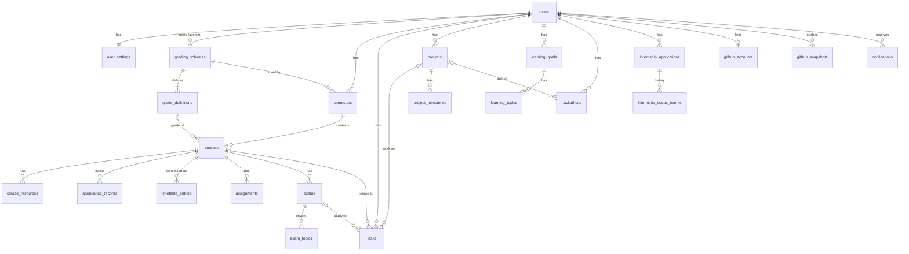

# NOVA — Database Design

> Status: **Phase 0 design, implemented phase by phase.** The SQL below is a *specification draft*. It becomes Flyway migrations (`V1__…`, `V2__…`) in the phase that introduces each feature.
>
> **Verified (Phase 0):** the DDL was applied to a scratch **PostgreSQL 16** instance with `tasks` created after `projects`, as the ordering note below describes. It created 23 tables. Constraint smoke tests passed:
>
> - A cross-tenant course insert is rejected by the composite FK.
> - A duplicate email differing only in case is rejected (originally `citext`; now emails are stored lower-cased with a `CHECK`, see §5).
> - A second "current" semester is rejected.
> - Attended > conducted is rejected.
> - A task marked DONE without `completed_at` is rejected.
> - Deleting a course nulls only `tasks.course_id`.
>
> **Not verified yet:** JPA mapping, audit columns (omitted below), and performance.
>
> **Implemented as Flyway migrations** (the files in `backend/src/main/resources/db/migration` are the source of truth; they add `created_at`/`updated_at` audit columns and name every constraint):
>
> | Migration | Tables | Phase |
> |---|---|---|
> | `V1__create_users.sql` | `users`, `user_settings` | 1 |
> | `V2__create_spring_session.sql` | `spring_session`, `spring_session_attributes` | 1 |
> | `V3__create_grading_semesters_courses.sql` | `grading_schemes`, `grade_definitions`, `semesters`, `courses` + the three built-in presets | 2.1 |
> | `V4__create_attendance_records.sql` | `attendance_records` | 2.2 |
| `V5__create_assignments_exams_resources.sql` | `course_resources`, `assignments`, `exams`, `exam_topics` | 2.3 |
| `V6__create_timetable_entries.sql` | `timetable_entries` | 2.4 |
| `V7__complete_onboarding_for_existing_users.sql` | data only: `user_settings.onboarding_completed_at` for accounts that already have a semester | 2.4 |
| `V8__create_tasks.sql` | `tasks` (without `project_id`, which V9 adds) | 3a |
| `V9__create_projects.sql` | `projects`, `project_milestones`; adds `tasks.project_id` | 4a |
| `V10__create_learning.sql` | `learning_goals`, `learning_topics`, `learning_resources`; adds `tasks.learning_goal_id` | 4b |
| `V11__create_hackathons.sql` | `hackathons`; adds `tasks.hackathon_id` | 4c |
| `V12__create_internships.sql` | `internship_applications`, `internship_status_events`; adds `tasks.internship_id` | 4d |
| `V13__create_github.sql` | `github_accounts`, `github_repos`, `github_contribution_days` | 4e |
>
> Differences from the draft in V3: `ordinal`, `position` and `color_hue` are `integer` rather than `smallint` (simpler Java mapping, same checks); `notes` is `varchar(2000)`; `grade_definitions` has a unique `(scheme_id, position)` too, and both of its unique constraints are **deferred to commit** so a scheme edit can swap labels or order between grades in one transaction; `courses.grade_definition_id` has its own index. V3 was applied to PostgreSQL 16 and its constraints were exercised directly (cross-tenant course, second current semester, duplicate ordinal, half-set grade, deleting an in-use scheme, label swap at commit, cascades): all behaved as designed.
>
> V4: `slot` is `integer`; the unique `(course_id, held_on, slot)` index replaces the planned `ix_attendance_course_date` (same leading columns), plus `ix_attendance_user`. Applied to PostgreSQL 16 and exercised (duplicate slot, second slot same day, cross-tenant record, bad status/slot, cascade on course delete).
>
> V5: every child row carries `user_id` with a composite FK to its parent's `(id, user_id)` (`exams` gains `uq_exams_id_user` as the target for `exam_topics`). `course_resources.url` must match `^https?://`. Assignment timestamps are tied to status by checks (`completed_at` set exactly when COMPLETED, `submitted_at` only when SUBMITTED/COMPLETED, COMPLETED means 100%). `ix_assignments_open_due` is partial (open work only). `exam_topics` stores `done_at` and a `position`; prep % is never stored. Applied to PostgreSQL 16 and exercised (cross-tenant assignment/topic, `javascript:` URL, completed without timestamp, submitted_at on an open assignment, progress > 100, bad kind, cascade from course to all four tables).
>
> V6: `day_of_week` is `integer` (ISO, 1 = Monday) and `kind` is `varchar(8)`; constraints are named, and `ix_timetable_course` is added for course-page lookups and cascades. Applied to PostgreSQL 16 and exercised (cross-tenant entry, day 8, end before start, bad kind, cascade on course delete).
>
> V7 changes no schema. Checked on PostgreSQL 16 with three accounts: one with semesters (marked onboarded), one without (left for onboarding) and one already onboarded (its original timestamp kept).
>
> V9: `projects.description` is `varchar(4000)` and `tech_stack` a `text[]` (at most 15 entries, checked); there is **no `progress_pct`**: progress is derived from milestones only. Links must match `^https?://`; `target_on` can't precede `started_on`. Milestones carry `user_id` with a composite FK to `projects (id, user_id)` (`uq_projects_id_user`), a `position` and `done_at`; `ix_milestones_open_due` is partial (open, dated milestones) for the calendar and Home. `tasks.project_id` references `projects (id, user_id)` with `on delete set null (project_id)`. Applied to PostgreSQL 16 and exercised (javascript: URL, bad status, 16 technologies, target before start, blank name, cross-tenant milestone, cross-tenant task link, and cascade to milestones plus set-null on tasks when a project is deleted).
>
> V13 replaces the draft's `github_snapshots` (a JSON payload per kind) with normalised tables: `github_accounts` (one per user: the username, the profile fields GitHub returned, ETags and fetch times per part, `backoff_until` for GitHub's rate-limit reset and `refresh_requested_at` for the 5-minute refresh throttle), `github_repos` and `github_contribution_days`. Typed rows need no JSON mapping, are easy to query for Home and project pages, and still hold only the subset NOVA shows. There's no token column yet: OAuth (with an encrypted token) comes later. Checks: GitHub's username format, https-only avatar and profile links, unique repositories and days per user, non-negative counts; repositories and days cascade from the account, which cascades from the user. Applied to PostgreSQL 16 and exercised (bad usernames, an http avatar, a duplicate repository, a negative count, and the cascade).
>
> V12: `internship_applications.status` adds `WITHDRAWN` to the draft list; `next_step` (`varchar(120)`) and `next_step_at` are new, and `notes` is `varchar(4000)`. Checks: company and role not blank, status in its list, `job_url` `^https?://`, and an applied date for anything but `SAVED`. `internship_status_events` carries `user_id` with a composite FK to `(id, user_id)` (`uq_internships_id_user`, `on delete cascade`) and checks `to_status`; analytics are derived from it, never stored. `tasks.internship_id` references the application with `on delete set null (internship_id)` and a partial index. Applied to PostgreSQL 16 and exercised (applied without a date, saved without one, bad status, blank role, `javascript:` link, cross-tenant event and task link, and cascade to events plus set-null on tasks when an application is deleted).
>
> V11: `hackathons.status` is progress only (`INTERESTED`, `REGISTERED`, `PARTICIPATING`, `SUBMITTED`, `FINISHED`, `SKIPPED`); the outcome is the free-text `result` (`varchar(160)`), never inferred, which replaces the draft's `SHORTLISTED`/`WON`/`COMPLETED` statuses. `team_members` is `varchar(500)` and `notes` `varchar(4000)`. Checks: name not blank, mode and status in their lists, every link `^https?://`, `ends_on` needs `starts_on` and isn't before it, registration closes no later than submissions. `project_id` references `projects (id, user_id)` with `on delete set null (project_id)`; `uq_hackathons_id_user` is the target for `tasks.hackathon_id` (`on delete set null (hackathon_id)`, partial index). Applied to PostgreSQL 16 and exercised (bad status and mode, end without start, end before start, registration after submission, `javascript:` certificate link, cross-tenant project and task links, and set-null on hackathons when a project is deleted and on tasks when a hackathon is).
>
> V10: there is **no stored progress**; it is derived from topics. `learning_goals.status` is checked (`ACTIVE`, `PAUSED`, `DONE`) and `uq_learning_goals_id_user` is the target for composite FKs from `learning_topics` and `learning_resources` (both `on delete cascade`, each carrying `user_id`). Topics keep a `position` and `done_at`; resource URLs must match `^https?://`. `tasks.learning_goal_id` references `learning_goals (id, user_id)` with `on delete set null (learning_goal_id)` and a partial index. Applied to PostgreSQL 16 and exercised (bad status, blank title, `javascript:` URL, cross-tenant topic and task link, cascade to topics and links plus set-null on tasks when a goal is deleted).
>
> V8: adds `planned_start time` (a start time on the planned day, which needs `planned_for`) and `recurrence_series_id` with a unique `(recurrence_series_id, planned_for)` index, so one series can't have two repeats on a day. Checks tie `completed_at` to `DONE`, and require `planned_for` for a start time or a repeat and a series id for a repeat. `course_id` and `exam_id` use composite FKs to `(id, user_id)` with `on delete set null (course_id)` / `(exam_id)`, which clears only the link column (PostgreSQL 15+). Partial indexes: `ix_tasks_open_planned`, `ix_tasks_open_due`, `ix_tasks_done`, plus `ix_tasks_course` and `ix_tasks_exam`. `project_id` and its FK come with projects in Phase 4. Applied to PostgreSQL 16 and exercised (cross-tenant course/exam, done without timestamp, start time or repeat without a day, repeat without series, duplicate series day, estimate out of range, and set-null on course and exam delete).

## 1. Design principles

1. **Every user-owned row carries `user_id`.** Authorization then becomes a simple `WHERE user_id = :me` backed by an index, and "list all my X" never needs a join.
2. **Parent/child ownership is enforced by the database, not just by code.** A child row's `(parent_id, user_id)` has a composite foreign key to the parent's `(id, user_id)`. The database therefore *cannot* store a course whose semester belongs to someone else, even if the service layer has a bug. (This is a good interview talking point: defence in depth.)
3. **Derived values are computed, not stored.** GPA, CGPA, attendance %, "can miss", learning progress and prep progress are all calculated from source rows. There are no stale caches to keep in sync. (The one exception is the GitHub snapshot cache, which *is* a cache of external data.)
4. **Enums are stored as `varchar` + `CHECK`, not PostgreSQL `ENUM` types.** They map cleanly to JPA `@Enumerated(STRING)`, and adding a value is a one-line migration (changing a PG enum is awkward inside transactions).
5. **Money-like precision for academics.** Credits and grade points use `numeric`, never `float`, so 8.5 × 3 is exact.
6. **Time:** instants are `timestamptz` (stored in UTC). Calendar dates without a time are `date`. Recurring wall-clock times (timetable) are `time` interpreted in the user's timezone.
7. **Primary keys: `uuid`.** They can't be enumerated in URLs (`/courses/5` → try `/courses/6`), and they're safe to generate in the app. The cost (16 bytes vs 8, less index locality) is irrelevant at our scale.
8. **Audit columns** `created_at`, `updated_at` (`timestamptz not null default now()`) on every table. They're omitted from the listings below for brevity.

## 2. Entity overview (23 tables plus Spring Session's 2)

| Domain | Tables |
|---|---|
| Identity | `users`, `user_settings` |
| Academics | `grading_schemes`, `grade_definitions`, `semesters`, `courses`, `course_resources`, `attendance_records`, `timetable_entries`, `assignments`, `exams`, `exam_topics` |
| Planner | `tasks` (the calendar is a *view* over other tables, not a table) |
| Developer | `projects`, `project_milestones`, `learning_goals`, `learning_topics`, `hackathons`, `internship_applications`, `internship_status_events`, `github_accounts`, `github_snapshots` |
| System | `notifications` |

**Tables I deliberately did not create:**

- **`grades`:** a course has exactly one grade, so it's a column (`grade_definition_id`) on `courses`, not a separate table.
- **`attendance` summary:** it's derived from baseline + records.
- **`events` / `calendar`:** the calendar aggregates existing entities.
- **`tech_stack`:** stored as `text[]` on projects (see §5).
- **Dashboard widgets:** a small `jsonb` preference in `user_settings`.

## 3. ER diagram



## 4. Schema (draft DDL)

```sql
create extension if not exists pgcrypto;    -- gen_random_uuid()

-- ───────────── Identity ─────────────
create table users (
  id              uuid primary key default gen_random_uuid(),
  email           varchar(254) not null unique check (email = lower(email)),  -- stored lower-cased by the app
  password_hash   varchar(100) not null,             -- BCrypt, prefixed {bcrypt}
  display_name    varchar(80)  not null,
  created_at      timestamptz not null default now(),
  updated_at      timestamptz not null default now()
);

create table user_settings (
  user_id                    uuid primary key references users(id) on delete cascade,
  timezone                   varchar(64) not null default 'UTC',   -- IANA, e.g. Asia/Kolkata (validated in service)
  week_start                 varchar(3)  not null default 'MON' check (week_start in ('MON','SUN')),
  university_name            varchar(120),
  default_attendance_target  numeric(5,2) check (default_attendance_target > 0 and default_attendance_target < 100),
                                                    -- nullable on purpose: NOVA never assumes a policy
  theme                      varchar(6) not null default 'SYSTEM' check (theme in ('LIGHT','DARK','SYSTEM')),
  -- dashboard_widgets jsonb: added with dashboard personalisation (Phase 6)
  onboarding_completed_at    timestamptz
);

-- ───────────── Grading ─────────────
create table grading_schemes (
  id          uuid primary key default gen_random_uuid(),
  user_id     uuid references users(id) on delete cascade,   -- NULL = built-in preset (read-only)
  name        varchar(60) not null,
  max_points  numeric(4,2) not null check (max_points > 0),   -- 10.00, 4.00 ...
  unique (id, user_id)
);

create table grade_definitions (
  id              uuid primary key default gen_random_uuid(),
  scheme_id       uuid not null references grading_schemes(id) on delete cascade,
  label           varchar(8)   not null,                 -- 'O', 'A+', 'B', 'F', 'P', 'W'
  points          numeric(4,2) not null check (points >= 0),
  is_passing      boolean not null,                      -- defines "minimum passing grade" per scheme
  counts_in_gpa   boolean not null default true,         -- false for Pass/Fail, Withdrawn, Audit
  position        smallint not null,                     -- display order (best → worst)
  unique (scheme_id, label)
);

-- ───────────── Academics ─────────────
create table semesters (
  id                 uuid primary key default gen_random_uuid(),
  user_id            uuid not null references users(id) on delete cascade,
  grading_scheme_id  uuid not null references grading_schemes(id),
  name               varchar(40) not null,              -- 'Semester 3', 'Fall 2026'
  ordinal            smallint not null check (ordinal > 0),
  starts_on          date,
  ends_on            date,
  is_current         boolean not null default false,
  attendance_target  numeric(5,2) check (attendance_target > 0 and attendance_target < 100),  -- overrides user default
  unique (id, user_id),
  unique (user_id, ordinal),
  check (ends_on is null or starts_on is null or ends_on >= starts_on)
);
create unique index ux_semesters_one_current on semesters(user_id) where is_current;   -- max 1 current semester

create table courses (
  id                    uuid primary key default gen_random_uuid(),
  user_id               uuid not null,
  semester_id           uuid not null,
  code                  varchar(20),                   -- 'CSE 201'
  name                  varchar(120) not null,
  credits               numeric(4,1) not null check (credits >= 0),
  faculty               varchar(120),
  color_hue             smallint check (color_hue between 0 and 359),   -- optional per-course accent
  notes                 text,
  grade_definition_id   uuid references grade_definitions(id),
  grade_kind            varchar(8) check (grade_kind in ('FINAL','EXPECTED')),
  attendance_target     numeric(5,2) check (attendance_target > 0 and attendance_target < 100), -- overrides semester
  baseline_conducted    integer not null default 0 check (baseline_conducted >= 0),
  baseline_attended     integer not null default 0 check (baseline_attended >= 0),
  unique (id, user_id),
  foreign key (semester_id, user_id) references semesters(id, user_id) on delete cascade,
  check (baseline_attended <= baseline_conducted),
  check ((grade_definition_id is null) = (grade_kind is null))
);
create index ix_courses_semester on courses(semester_id);

create table course_resources (
  id         uuid primary key default gen_random_uuid(),
  user_id    uuid not null,
  course_id  uuid not null,
  title      varchar(120) not null,
  url        varchar(2048) not null check (url ~* '^https?://'),
  foreign key (course_id, user_id) references courses(id, user_id) on delete cascade
);
create index ix_course_resources_course on course_resources(course_id);

create table attendance_records (
  id         uuid primary key default gen_random_uuid(),
  user_id    uuid not null,
  course_id  uuid not null,
  held_on    date not null,
  slot       smallint not null default 1 check (slot between 1 and 12),  -- 2 classes same day → slot 1, 2
  status     varchar(9) not null check (status in ('PRESENT','ABSENT','CANCELLED')),
  foreign key (course_id, user_id) references courses(id, user_id) on delete cascade,
  unique (course_id, held_on, slot)
);
create index ix_attendance_course_date on attendance_records(course_id, held_on);

create table timetable_entries (
  id           uuid primary key default gen_random_uuid(),
  user_id      uuid not null,
  course_id    uuid not null,
  day_of_week  smallint not null check (day_of_week between 1 and 7),   -- ISO: 1 = Monday
  starts_at    time not null,
  ends_at      time not null,
  kind         varchar(9) not null default 'LECTURE' check (kind in ('LECTURE','LAB','TUTORIAL','OTHER')),
  location     varchar(60),
  instructor   varchar(120),
  foreign key (course_id, user_id) references courses(id, user_id) on delete cascade,
  check (ends_at > starts_at)
);
create index ix_timetable_user_day on timetable_entries(user_id, day_of_week, starts_at);

create table assignments (
  id                 uuid primary key default gen_random_uuid(),
  user_id            uuid not null,
  course_id          uuid not null,
  title              varchar(160) not null,
  description        text,
  due_at             timestamptz not null,
  priority           varchar(6) not null default 'MEDIUM' check (priority in ('LOW','MEDIUM','HIGH')),
  status             varchar(11) not null default 'NOT_STARTED'
                       check (status in ('NOT_STARTED','IN_PROGRESS','SUBMITTED','COMPLETED')),
  estimated_minutes  integer check (estimated_minutes > 0),
  progress_pct       smallint not null default 0 check (progress_pct between 0 and 100),
  submitted_at       timestamptz,
  completed_at       timestamptz,
  foreign key (course_id, user_id) references courses(id, user_id) on delete cascade
);
create index ix_assignments_open_due on assignments(user_id, due_at)
  where status in ('NOT_STARTED','IN_PROGRESS');           -- partial index: "what's due" never scans finished work
create index ix_assignments_course on assignments(course_id);

create table exams (
  id                uuid primary key default gen_random_uuid(),
  user_id           uuid not null,
  course_id         uuid not null,
  title             varchar(120) not null,           -- 'Mid-semester 1'
  kind              varchar(7) not null default 'OTHER' check (kind in ('QUIZ','MIDTERM','FINAL','LAB','OTHER')),
  starts_at         timestamptz not null,
  duration_minutes  integer check (duration_minutes > 0),
  location          varchar(60),
  unique (id, user_id),
  foreign key (course_id, user_id) references courses(id, user_id) on delete cascade
);
create index ix_exams_user_start on exams(user_id, starts_at);

create table exam_topics (
  id        uuid primary key default gen_random_uuid(),
  user_id   uuid not null,
  exam_id   uuid not null,
  title     varchar(160) not null,
  position  smallint not null,
  done_at   timestamptz,                               -- prep % = done / total (derived)
  foreign key (exam_id, user_id) references exams(id, user_id) on delete cascade
);
create index ix_exam_topics_exam on exam_topics(exam_id, position);

-- ───────────── Planner ─────────────
create table tasks (
  id                    uuid primary key default gen_random_uuid(),
  user_id               uuid not null references users(id) on delete cascade,
  title                 varchar(160) not null,
  description           text,
  category              varchar(11) not null default 'PERSONAL'
                          check (category in ('ACADEMIC','CODING','PERSONAL','INTERNSHIP','OPEN_SOURCE','PROJECT')),
  priority              varchar(6) not null default 'MEDIUM' check (priority in ('LOW','MEDIUM','HIGH')),
  status                varchar(11) not null default 'TODO' check (status in ('TODO','IN_PROGRESS','DONE')),
  planned_for           date,          -- "do date": which day I intend to work on it
  due_at                timestamptz,   -- "due date": hard deadline (optional)
  estimated_minutes     integer check (estimated_minutes > 0),
  completed_at          timestamptz,
  recurrence            varchar(8) not null default 'NONE' check (recurrence in ('NONE','DAILY','WEEKDAYS','WEEKLY')),
  recurrence_series_id  uuid,          -- groups instances of one recurring task
  course_id             uuid,
  exam_id               uuid,
  project_id            uuid,
  foreign key (course_id, user_id)  references courses(id, user_id)  on delete set null (course_id),
  foreign key (exam_id, user_id)    references exams(id, user_id)    on delete set null (exam_id),
  foreign key (project_id, user_id) references projects(id, user_id) on delete set null (project_id),
  check ((status = 'DONE') = (completed_at is not null))
);
create index ix_tasks_open_planned on tasks(user_id, planned_for) where status <> 'DONE';
create index ix_tasks_open_due     on tasks(user_id, due_at)      where status <> 'DONE';
create index ix_tasks_done         on tasks(user_id, completed_at desc) where status = 'DONE';
create index ix_tasks_exam         on tasks(exam_id) where exam_id is not null;

-- ───────────── Developer ─────────────
create table projects (
  id            uuid primary key default gen_random_uuid(),
  user_id       uuid not null references users(id) on delete cascade,
  name          varchar(100) not null,
  description   text,
  tech_stack    text[] not null default '{}',
  repo_url      varchar(2048) check (repo_url ~* '^https?://'),
  demo_url      varchar(2048) check (demo_url ~* '^https?://'),
  status        varchar(11) not null default 'IDEA'
                  check (status in ('IDEA','PLANNING','DEVELOPMENT','COMPLETED','ARCHIVED')),
  started_on    date,
  target_on     date,
  progress_pct  smallint check (progress_pct between 0 and 100),   -- manual; used only if no milestones
  unique (id, user_id)
);
create index ix_projects_user_status on projects(user_id, status);

create table project_milestones (
  id          uuid primary key default gen_random_uuid(),
  user_id     uuid not null,
  project_id  uuid not null,
  title       varchar(160) not null,
  due_on      date,
  position    smallint not null,
  done_at     timestamptz,
  foreign key (project_id, user_id) references projects(id, user_id) on delete cascade
);
create index ix_milestones_project on project_milestones(project_id, position);

create table learning_goals (
  id           uuid primary key default gen_random_uuid(),
  user_id      uuid not null references users(id) on delete cascade,
  title        varchar(100) not null,                 -- 'Spring Boot'
  description  text,
  status       varchar(6) not null default 'ACTIVE' check (status in ('ACTIVE','PAUSED','DONE')),
  target_on    date,
  unique (id, user_id)
);

create table learning_topics (
  id        uuid primary key default gen_random_uuid(),
  user_id   uuid not null,
  goal_id   uuid not null,
  title     varchar(160) not null,                    -- 'Dependency Injection'
  position  smallint not null,
  done_at   timestamptz,
  foreign key (goal_id, user_id) references learning_goals(id, user_id) on delete cascade
);
create index ix_learning_topics_goal on learning_topics(goal_id, position);

create table hackathons (
  id                     uuid primary key default gen_random_uuid(),
  user_id                uuid not null references users(id) on delete cascade,
  name                   varchar(120) not null,
  organizer              varchar(120),
  starts_on              date,
  ends_on                date,
  mode                   varchar(7) check (mode in ('ONLINE','OFFLINE','HYBRID')),
  location               varchar(120),
  website_url            varchar(2048) check (website_url ~* '^https?://'),
  registration_deadline  timestamptz,
  submission_deadline    timestamptz,
  status                 varchar(13) not null default 'INTERESTED'   -- progress only (V11); the outcome is `result`
                           check (status in ('INTERESTED','REGISTERED','PARTICIPATING','SUBMITTED','FINISHED','SKIPPED')),
  team_name              varchar(80),
  team_members           text,                        -- free text; teammates aren't NOVA users
  project_id             uuid,
  result                 varchar(160),                -- only what the user writes; never inferred
  repo_url               varchar(2048) check (repo_url ~* '^https?://'),
  demo_url               varchar(2048) check (demo_url ~* '^https?://'),
  certificate_url        varchar(2048) check (certificate_url ~* '^https?://'),
  foreign key (project_id, user_id) references projects(id, user_id) on delete set null (project_id),
  check (ends_on is null or starts_on is null or ends_on >= starts_on)
);
create index ix_hackathons_user_start on hackathons(user_id, starts_on);

create table internship_applications (
  id              uuid primary key default gen_random_uuid(),
  user_id         uuid not null references users(id) on delete cascade,
  company         varchar(120) not null,
  role            varchar(120) not null,
  location        varchar(120),
  job_url         varchar(2048) check (job_url ~* '^https?://'),
  source          varchar(60),                       -- 'LinkedIn', 'Referral', 'Campus'
  status          varchar(10) not null default 'APPLIED'
                    check (status in ('SAVED','APPLIED','ASSESSMENT','INTERVIEW','OFFER','REJECTED','WITHDRAWN')),  -- V12
  applied_on      date,
  deadline_at     timestamptz,
  resume_version  varchar(60),                       -- label, e.g. 'v3-backend'
  notes           text,
  unique (id, user_id),
  check (status = 'SAVED' or applied_on is not null)
);
create index ix_internships_user_status  on internship_applications(user_id, status);
create index ix_internships_user_applied on internship_applications(user_id, applied_on desc);

create table internship_status_events (
  id              uuid primary key default gen_random_uuid(),
  user_id         uuid not null,
  application_id  uuid not null,
  from_status     varchar(10),
  to_status       varchar(10) not null,
  changed_at      timestamptz not null default now(),
  foreign key (application_id, user_id) references internship_applications(id, user_id) on delete cascade
);
create index ix_internship_events_app on internship_status_events(application_id, changed_at);

create table github_accounts (
  user_id                  uuid primary key references users(id) on delete cascade,
  username                 varchar(39) not null,     -- GitHub's max login length
  github_user_id           bigint,
  access_token_ciphertext  bytea,                    -- AES-256-GCM; NULL in public (username-only) mode
  token_scopes             varchar(200),
  connected_at             timestamptz not null default now()
);

create table github_snapshots (
  id          uuid primary key default gen_random_uuid(),
  user_id     uuid not null references users(id) on delete cascade,
  kind        varchar(20) not null check (kind in ('PROFILE','REPOS','CONTRIBUTIONS')),
  etag        varchar(200),
  payload     jsonb not null,                        -- normalized subset of the API response, not raw dumps
  fetched_at  timestamptz not null,
  unique (user_id, kind)
);

-- ───────────── System ─────────────
create table notifications (
  id           uuid primary key default gen_random_uuid(),
  user_id      uuid not null references users(id) on delete cascade,
  type         varchar(30) not null,                 -- ASSIGNMENT_DUE_SOON, EXAM_APPROACHING, ATTENDANCE_AT_RISK, TASK_OVERDUE, ...
  title        varchar(160) not null,
  body         varchar(500),
  link_path    varchar(200),                         -- in-app route, e.g. /app/academics/exams/{id}
  dedupe_key   varchar(120) not null,                -- e.g. 'EXAM_APPROACHING:{examId}:3d'
  read_at      timestamptz,
  created_at   timestamptz not null default now(),
  unique (user_id, dedupe_key)                       -- the scheduler can run any number of times safely
);
create index ix_notifications_unread on notifications(user_id, created_at desc) where read_at is null;
create index ix_notifications_user   on notifications(user_id, created_at desc);

-- Added in V14 with the notifications themselves:
create table notification_mutes (            -- types switched off in Settings; no row = on
  user_id uuid not null references users(id) on delete cascade,
  type    varchar(30) not null,
  primary key (user_id, type)
);
create table notification_states (           -- the last state a change-based rule saw ('ATTENDANCE:{courseId}' → 'AT_RISK')
  user_id    uuid not null references users(id) on delete cascade,
  subject    varchar(80) not null,
  state      varchar(20) not null,
  updated_at timestamptz not null default now(),
  primary key (user_id, subject)
);
```

> **Ordering note:** `tasks` references `projects` and `exams`, so in the real migrations `projects` is created before the task foreign key is added (the planner and developer phases add the FKs with `ALTER TABLE`).
>
> **Postgres version:** `ON DELETE SET NULL (column)` (nulling only one column of a composite FK) requires **PostgreSQL 15+**. We target 16+.

## 5. Key design decisions

| Decision | Alternatives | Why |
|---|---|---|
| Grade as a column on `courses` + `grade_kind` FINAL/EXPECTED | A separate `grades` table | One grade per course. EXPECTED grades power a *projected* CGPA without polluting the official figure. |
| Grading scheme is data (`grade_definitions`) with `is_passing`, `counts_in_gpa` | Hard-coded 10-point scale | Supports 10-point (Indian), 4.0 (US), pass/fail and withdrawn grades. Built-in presets are rows with `user_id = NULL`, and users clone them to edit. |
| Attendance = **baseline counts + per-class records** | Only counts; only records | Students usually join mid-semester already knowing "28 of 34" from the portal (the baseline). From then on each class is one tap (a record), which enables history and trends. Cancelled classes don't count. |
| Tasks have both `planned_for` (do date) and `due_at` (deadline) | One date | "Due Friday, but I'll do it Tuesday" is how people actually plan. Today = planned today ∪ due today ∪ overdue. |
| Recurrence = simple enum + series id; the next instance is created when one is completed | RFC 5545 RRULE, pre-generated instances | Covers ~95% of student needs, avoids generating thousands of rows, and is easy to test. RRULE is a possible future upgrade. |
| `tech_stack text[]` | A `technologies` join table | Tags are only displayed and filtered per user. An array with a GIN index (if ever needed) is simpler. A join table pays off only for cross-user analytics, which NOVA doesn't do. |
| Internship status history table | Only the current status | Response rate and "time to first response" need the history. Also enables a timeline UI. |
| Added `SAVED` internship status | Only the 5 statuses in the brief | Your brief tracks a *deadline*, which matters before you apply. SAVED is the "wishlist" stage. **Confirmed 2026-09-28.** Response-rate analytics ignore SAVED entries. |
| Email as lower-cased `varchar` + `CHECK (email = lower(email))` + unique index (changed from `citext` in Phase 1) | `citext` extension | Same case-insensitive uniqueness, no extension to install on hosted Postgres, and Hibernate schema validation maps it without custom column definitions. The app normalises emails once (`User.normalizeEmail`). |
| Composite FKs `(parent_id, user_id)` | FK on `parent_id` only | The database guarantees tenant consistency. It costs one extra unique constraint per parent. |
| `github_snapshots.payload` stores a *normalized subset* | Raw API dumps | Smaller rows, a stable shape for our code, and no unneeded personal data stored. |

## 6. Derived values (computed in pure Java calculators)

All arithmetic uses `BigDecimal`; rounding (HALF_UP, 2 dp) happens **only for display**.

**Semester GPA**

```
GPA = Σ (credits_i × points_i) / Σ credits_i
      over courses in the semester with grade_kind = FINAL and grade.counts_in_gpa = true and credits > 0
```

- **Null / empty:** undefined (shown as "—") when the denominator is 0.
- **CGPA:** the same formula across *all* semesters (a credit-weighted mean, **not** the average of semester GPAs, which is a common bug).
- **Projected CGPA:** the same formula including `EXPECTED` grades.
- **Credits:** `completed credits` = Σ credits where the grade is FINAL and `is_passing`. `Total credits` = Σ credits of all courses.

**Attendance** (per course)

- `C` (classes conducted) = `baseline_conducted` + count(records with status PRESENT or ABSENT)
- `A` (classes attended) = `baseline_attended` + count(records with status PRESENT)
- `t` = target as a fraction, 0 < t < 1
- `%` = A / C (undefined when C = 0)

**Classes you can still miss.** This is the largest *k* ≥ 0 such that A / (C + k) ≥ t, which gives *k* = ⌊A / t − C⌋, or 0 if that is negative.

- Example: A=28, C=34, t=0.75. Then 28 / 0.75 = 37.33, so *k* = ⌊37.33 − 34⌋ = **3**. Check: 28/37 = 75.7% ✓ and 28/38 = 73.7% ✗.

**Classes you need to attend in a row to reach the target.** This is the smallest *n* ≥ 0 such that (A + n) / (C + n) ≥ t, which gives *n* = ⌈(t·C − A) / (1 − t)⌉.

- Example: A=20, C=30, t=0.75. Then (22.5 − 20) / 0.25 = 10, so *n* = **10**. Check: 30/40 = 75% ✓.

**Target resolution:** course target → semester target → user default → *not set* (the UI asks the user to set one; nothing is assumed).

**Precision:** calculations use exact rationals (`BigDecimal`, with t taken from `numeric(5,2)`), so a floor or ceiling is never off by one because of floating-point error. The edge cases get tests: t = exactly achieved, C = 0, A = C, and large values.

**Other derived values**

- **Progress:** learning goal % = done topics / total topics; exam prep % = done / total topics; project % = done milestones / total, or the manual `progress_pct` if there are no milestones.
- **Internship response rate:** applications that ever moved beyond APPLIED / applications with `applied_on` in the window. It's labelled as a *NOVA metric*, with the formula shown.

## 7. Index strategy (why each exists)

| Index | Serves |
|---|---|
| `ix_assignments_open_due` (partial) | Dashboard "upcoming deadlines", notifications, insights. Only open work is indexed, so the index stays small as history grows. |
| `ix_tasks_open_planned`, `ix_tasks_open_due` (partial) | Today view, Upcoming view, overdue detection |
| `ix_tasks_done` | "Completed" view (paginated, newest first) and weekly completion rate |
| `ix_exams_user_start` | Exam countdown, calendar range queries |
| `ix_timetable_user_day` | Today's classes, weekly grid |
| `ix_attendance_course_date` | Per-course counts, history |
| `ix_notifications_unread` (partial) | Bell badge count, which is the hottest query in the app |
| `ux_semesters_one_current` (partial unique) | Enforces at most one current semester per user |
| Child-FK indexes (`ix_*_course`, `ix_*_goal`, …) | PostgreSQL does **not** auto-index FK columns. Without these, deleting a parent row scans the whole child table. |

**Search (Phase 5):** starts with `ILIKE` over titles, limited to 5 results per type. Trigram (`pg_trgm`) GIN indexes are added only if measurements show a need.

## 8. Seed and demo data

- **"Try the demo"** (`POST /api/v1/demo`, Phase 7) creates a temporary account and seeds it through the normal services (`DemoSeeder`): three semesters, courses and grades, attendance, coursework, tasks, projects, a learning goal, hackathons and internship applications, all dated relative to the visitor's today. The data is **clearly fictional**: invented courses, `example.com` links, no real people and no GitHub data (the GitHub page starts "not connected"). The browser mock (`frontend/src/mocks/demo.ts`) holds the same story.
- A demo account is an ordinary `users` row with `demo_expires_at` set (V15), 24 hours after creation. `DemoCleanup` deletes expired ones hourly; everything a user owns cascades with the row, and their Spring Session rows are deleted by principal name.
- Built-in grading presets are inserted by migration:
  - "10-point (O/A+/A/B+/B/C/P/F)" with points 10/9/8/7/6/5/4/0
  - "4.0 US (A–F)"
  - "Pass/Fail"
- The presets are **examples, not assumed university policies.** The UI states this and users can clone and edit them.
